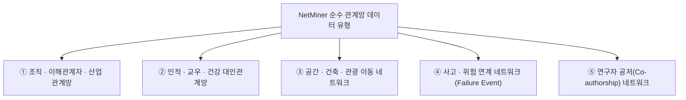

# 넷마이너(NetMiner) 순수 관계망(Relational Network) 데이터 활용 연구 분석 보고서
**— 비정형 텍스트 외 개체(Actor)·조직·공간·사고 관계망 데이터 활용 사례 정리 —**

> **[문서 정보]**  
> - **분석 대상 데이터**: `D:\soojin\03_marketing\netminer_info\nm-reference\research_metadata.xlsx` (Sheet 1: `2016이후` 시트)  
> - **작성일**: 2026년 09월 22일 (2023년 이후 신규 논문 297건 검토 반영)  
> - **작성 주체**: (주) 사이람 마케팅 팀  
> - **작성 목적**: 넷마이너 수록 논문 중 '비정형 텍스트(뉴스/서지/SNS)'가 아닌 **순수 관계망 데이터(인적 네트워크, 조직/이해관계자 파워, 공간 이동, 사고 연계망 등)**를 활용한 대표적 연구 사례 및 데이터 구조를 정리  

---

## 1. 개요 (Overview)

넷마이너(NetMiner) 수록 논문 중에는 텍스트 마이닝이 아닌, **실제 개체(Actor) 간의 인접 행렬(Adjacency Matrix), 1-Mode/2-Mode 노드-링크 관계 데이터**를 입력하여 사회망 분석(SNA)을 수행한 연구들이 명확하게 존재합니다.

전체 논문 중 순수 관계망 데이터를 다룬 연구는 약 **7%~20%**를 차지하며, 특히 **건설 프로젝트 이해관계자 파워 분석**, **지역사회 노인 친교망**, **정책 입망 이해관계자 네트워크**, **공간 배치-대인관계 연계**, **사고 원인 파급 네트워크** 등의 연구가 최고 수준의 피인용(140회 이상) 및 높은 학술적 영향력을 기록하고 있습니다.

---

## 2. 순수 관계망 데이터 5대 대표 유형 및 활용 사례

---

### 2.1 조직 · 이해관계자 · 산업 파워 관계망 (Inter-organizational & Stakeholder Networks)
- **데이터 성격**: 프로젝트 참여 주체 간 파워/영향력, 이해관계자 갈등, 정부/공공기관 간 정책 찬반 대립 관계 Matrix.
- **주요 활용 지표**: 매개 중심성(Betweenness), 연결 중심성(Degree), 파워 지표(Power Index), Blockmodeling.
- **대표 수록 논문**:
  1. *Social network analysis for social risks of construction projects in high-density urban areas in China*  
     *(Journal of Cleaner Production, **피인용 141회**)*  
     - **데이터**: 고밀도 도시 건설 프로젝트의 주민, 시공사, 지자체 등 이해관계자 간 리스크 파급 관계망
  2. *Who should take the responsibility? Stakeholders' power over social responsibility issues in construction projects*  
     *(Journal of Cleaner Production, **피인용 82회**)*  
     - **데이터**: 건설 프로젝트 사회적 책임(CSR) 이슈에 대한 이해관계자 간 파워 구조 네트워크
  3. *Policy network analysis the legislation process for medical privatization in Korea*  
     *(Health Policy and Technology, 2022)*  
     - **데이터**: 의료 민영화 입법 과정에서 국회의원, 의료 단체, 시민단체 간 정책 찬반 및 협력 관계망(Policy Network)
  4. *일 지역의 노인 치매 돌봄서비스 공급자원의 사회 네트워크 분석 (A Social Network Analysis of the Delivery Networks for the Older Adults and Dementia Care Services)*  
     *(한국농촌간호학회지, 2025)* **[2023년 이후 신규 사례]**  
     - **데이터**: 일개 지역의 노인·치매 돌봄서비스를 제공하는 21개 기관 간 실제 연계·의뢰 관계망을 직접 조사하여 구축한 조직 간(inter-organizational) 관계망
  5. *충청권 대학의 공동연구 네트워크 변화 분석: 네트워크 중심성과 협력 구조의 연도별 진화를 중심으로 (2018~2022)*  
     *(한국비교정부학보, 2025)* **[2023년 이후 신규 사례]**  
     - **데이터**: 충청권 소재 대학들의 공동연구(협력) 실적을 바탕으로 구축한 대학 간(university-to-university) 협력 네트워크의 연도별 중심성 변화

---

### 2.2 인적 · 교우 · 건강 대인관계망 (Personal & Social Interaction Networks)
- **데이터 성격**: 설문조사/면접을 통해 직접 측정한 사람 간의 친교, 정보 공유, 감정적 지지, 게임 중독 교우 관계망.
- **주요 활용 지표**: Ego Network 중심성, 밀도(Density), 응집도(Cohesion), 다중회귀 분석 연계.
- **대표 수록 논문**:
  1. *The Impact of Social Network Characteristics on Health among Community-Dwelling Older Adults in Korea*  
     *(International Journal of Environmental Research and Public Health, 2022, **피인용 8회**)*  
     - **데이터**: 지역사회 거주 노인 146명의 대인 친교 관계망(Ego Network) 데이터를 직접 수집하여 노인의 건강 및 우울감에 미치는 영향 분석
  2. *Correlational study between online friendship network and internet game disorder among university students*  
     *(Brain and Behavior, 2021, **피인용 7회**)*  
     - **데이터**: 대학생 간 온라인 친구 관계망(Friendship Network) 구조와 인터넷 게임 장애 간 상관성 분석
  3. *종합병원 간호단위의 간호사 관계 네트워크 연구 (Relationship networks among nurses in acute nursing care units)*  
     *(한국간호교육학회지, 2024)* **[2023년 이후 신규 사례]**  
     - **데이터**: 2개 종합병원 4개 간호단위 소속 간호사들을 대상으로 직접 조사한 업무·정보 교류 관계망(설문 기반 실제 인적 네트워크)
  4. *The Impact of Late Adolescents' Social Network Strength on Mental Health*  
     *(Brain and Behavior, 2025)* **[2023년 이후 신규 사례]**  
     - **데이터**: 후기 청소년의 대인관계 강도(연결/근접/매개 중심성 등)를 측정한 개인 관계망(Ego Network) 데이터와 정신건강 간 관계 분석
  - 참고로 위 IJERPH(2022) 노인 친교망 연구와 동일 주제의 관련 초록이 *Alzheimer's & Dementia* (2023)에도 게재되어, 지역사회 노인 친교망 연구가 지속적으로 재생산되고 있음을 확인함.

---

### 2.3 공간 · 건축 · 관광 이동 네트워크 (Spatial & Movement Networks)
- **데이터 성격**: 건축물 내 공간 배치 관계, 관광 지점 간 방문 이동 연결망(Spatial Layout & Co-visitation).
- **주요 활용 지표**: Space Syntax 연계 중심성, 2-Mode 네트워크, 최단 경로(Shortest Path).
- **대표 수록 논문**:
  1. *The association of spatial configuration with social network for elderly in social housing*  
     *(Indoor and Built Environment, 2020)*  
     - **데이터**: 임대주택의 공간 배치(Spatial Configuration)와 노인 거주자 간 소셜 네트워크 형성 간 상호작용 분석
  2. *Co-visitation network in tourism-driven peri-urban area based on social media analytics*  
     *(Landscape and Urban Planning, 2020, **피인용 37회**)*  
     - **데이터**: 관광객의 개별 관광 지점 간 실제 동반 방문 및 이동 연계 네트워크

---

### 2.4 사고 · 위험 연계 네트워크 (Safety Failure Event Networks)
- **데이터 성격**: 시스템 안전 사고 원인 간의 파급 연계 관계, 위험물 운송 시스템의 원인-결과 체인 Matrix.
- **주요 활용 지표**: Directed Network 매개 중심성, 하위 리스크 패스 도출.
- **대표 수록 논문**:
  1. *Using an expanded Safety Failure Event Network to analyze railway dangerous goods transportation system risk-accident*  
     *(Journal of Loss Prevention in the Process Industries, 2020, **피인용 20회**)*  
     - **데이터**: 철도 위험물 운송 시스템에서 발생하는 2001년 이후 사고 사례별 원인 요인 간 파급 연계망(Safety Failure Event Network)

---

### 2.5 연구자 공저(Co-authorship) & 기술 특허 네트워크
- **데이터 성격**: 저자-저자 간 공동 집필 행렬, 기관-기관 간 기술 협력 네트워크.
- **주요 활용 지표**: Modularity 커뮤니티, 서지 결합, 중심성 분석.
- **대표 수록 논문**:
  1. *대한가정학회지 연구 동향 및 공저자 네트워크 분석: 2010~2022년 게재 논문을 중심으로 (Research Trends and Co-author Network Analysis of the Journal of the Korean Home Economics Association)*  
     *(Human Ecology Research, 2024)* **[2023년 이후 신규 사례]**  
     - **데이터**: 대한가정학회지에 2010~2022년 게재된 논문의 저자-저자 간 실제 공동 집필(Co-authorship) 관계망을 구축하여 핵심 연구자 및 협업 클러스터 도출

---

## 3. 마케팅 및 교육 관점에서의 시사점

1. **"텍스트 외 데이터" 분석 수요 존재**:
   - 넷마이너는 단순 텍스트 마이닝 툴이 아니라, **설문조사 기반 대인 관계망(Ego Network)**, **조직 간 이해관계자 파워**, **공간 이용망**, **사고 원인망** 등 정통 네트워크 데이터를 완벽히 처리하는 전문 SNA 도구임을 강조할 수 있습니다.
2. **복합 데이터 가이드북 제안**:
   - *"설문조사 엑셀 데이터(노드-링크 행렬)를 NetMiner로 불러와 대인 관계망 중심성 계산하기"*
   - *"건설/행정 조직 간 이해관계자 파워 및 갈등 네트워크 시각화 튜토리얼"*

---
*보고서 관련 문의: (주) 사이람 마케팅 팀*
