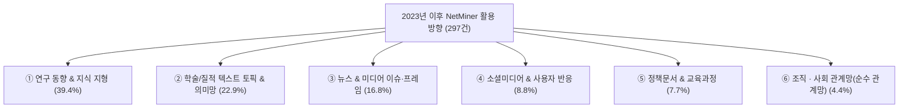

# 넷마이너(NetMiner) 최신 수록 논문 서지 데이터 분석 보고서
**— 2023년 이후 수록 논문(297건) 기반 최근 연구 분야 및 활용 방향 트렌드 분석 —**

> **[문서 정보]**  
> - **분석 대상 데이터**: `D:\soojin\03_marketing\netminer_info\nm-reference\research_metadata.xlsx` (Sheet: `2016년이후` 시트 중 **2023년 이후 발표 논문 297건**, 구분="활용" 필터 적용)  
> - **작성일**: 2026년 09월 22일  
> - **작성 주체**: (주) 사이람 마케팅 팀  
> - **작성 목적**: 최근 3.5년(2023년~2026년) 동안 넷마이너(NetMiner)를 활용한 최신 연구의 **(1) 세부 학문 분야 집중도**, **(2) 최신 활용 트렌드 변화**, **(3) 전체(2016년 이후) 대비 변화점**을 비교 분석하여 최신 마케팅 메시지 및 프로모션 전략 수립에 활용  
> - **분류 방법**: category 컬럼(전체 논문의 약 55%만 기재)에만 의존하지 않고, title/title_ko/abstract/journal/keywords를 모두 정독하여 세부 학문 분야 및 활용 방향을 직접 재분류함  

---

## 1. 개요 및 핵심 트렌드 변화 (Key Trends 2023+)

2023년 이후 발표된 넷마이너 수록 논문 297건을 정밀 분석한 결과, **간호·보건학이 최대 응용 분야로 확인**되었으며, 교육학과 함께 두 축이 전체의 절반 이상을 차지하는 것으로 나타났습니다.

### 1.1 핵심 요약 및 3대 변화 포인트

```
┌────────────────────────────────────────────────────────────────────────┐
│ 2023년 이후 NetMiner 연구의 3대 핵심 변화                              │
├────────────────────────────────────────────────────────────────────────┤
│ 1. [간호·보건학의 최대 응용 분야 부상]                                  │
│    - 의학·보건·간호학(30.6%), 교육학(26.3%), 체육학(12.8%) Top 3: 69.7% │
│    - 신규간호사 적응, 환자안전, 간호조직문화, 소진(burnout) 등          │
│      반복 재생산되는 간호학 연구 클러스터가 뚜렷하게 형성됨              │
│                                                                        │
│ 2. [뉴스·미디어 빅데이터 분석의 꾸준한 확산]                            │
│    - 전체의 16.8%(50건)가 빅카인즈 등 뉴스 빅데이터 기반 이슈/프레임 분석 │
│    - 과로사·과로자살, 안락사·연명의료, 스포츠 정책, AI 심판/챗봇 등     │
│      사회적 이슈에 대한 언론 프레임 분석에 NetMiner가 널리 활용됨       │
│                                                                        │
│ 3. [텍스트 마이닝 대비 소수지만 뚜렷한 '순수 관계망' 활용 지속]          │
│    - 간호사 관계망, 대학 공동연구 네트워크, 지역 돌봄서비스 공급망 등    │
│      실제 개체 간(actor-to-actor) 관계 데이터 분석 사례가 4.4%(13건)로  │
│      꾸준히 발견되며, NetMiner가 텍스트 분석 전용 도구가 아님을 재확인   │
└────────────────────────────────────────────────────────────────────────┘
```

---

## 2. 2023년 이후 주요 연구 분야별 현황 (Academic Domains 2023+)

| 순위 | 주요 연구 분야 | 2023년 이후 논문 수 | 비중(%) | 주요 특징 및 대표 세부 영역 |
|:---:|:---|:---:|:---:|:---|
| **1** | **의학 · 보건 · 간호학** | **91건** | **30.6%** | 간호교육/신규간호사 적응, 환자안전, 소진(burnout), 한의학 처방 네트워크, 작업치료, 치의학, 장애인 재활 |
| **2** | **교육학 · 교과교육학** | **78건** | **26.3%** | 유아교육, 교과교육(국어/영어/과학), 교사교육, 평생교육, 상담학, 교육공학 |
| **3** | **체육 · 스포츠과학** | **38건** | **12.8%** | 태권도, 스포츠 측정평가, 학교체육, e스포츠, 스포츠 정책/미디어 이슈 |
| **4** | **기타 인문사회 & 융합연구** | **27건** | **9.1%** | 언어학/국문학, 신학, 자연과학·공학, 생활과학(가정학), 다학제 융합저널 |
| **5** | **행정 · 정책 · 사회과학** | **27건** | **9.1%** | 복지정책, 청년/노인 정책, 지역사회 통합, R&D 예산 네트워크, 도시재생 |
| **6** | **경영 · 마케팅 · 기업전략** | **15건** | **5.1%** | 소비자 XR 리뷰, 블록체인, 플랫폼 서비스 가치공동파괴, 무역/국제경영 |
| **7** | **문화 · 관광 · 예술** | **15건** | **5.1%** | 미술관 이용행태, 무용/미술치료, 부산엑스포 유튜브 분석, 문화도시 |
| **8** | **언론 · 미디어 · 광고홍보** | **5건** | **1.7%** | K-POP/할로윈 참사 등 해외 뉴스 빅데이터 분석, 연명의료 담론 미디어 프레임 |
| **9** | **문헌정보학 · 서지학** | **1건** | **0.3%** | 국내 문헌정보학 분야 동시인용 기반 지적구조 분석 |
| **합계** | **전체** | **297건** | **100.0%** | 최근 3.5년 데이터 정밀 재분류 |

> ※ 2016년 이후 전체 활용 논문(724건) 대비, 2023년 이후 논문은 297건(41.0%)에 해당하며, 이전 분석 대비 간호·보건학 비중이 크게 재확인된 점이 특징입니다(구 분석은 category 컬럼 의존도가 높아 영문 간호 저널 다수가 세부 분류에서 누락되었던 것으로 추정됨).

---

## 3. 2023년 이후 주요 활용 방향 (Application Directions 2023+)

2023년 이후 논문의 활용 목적은 **'연구 동향/지식 지형 분석'**이 여전히 최대 비중(39.4%)을 차지하는 가운데, **'학술 텍스트(질적 인터뷰·개방형 설문·저널) 토픽 분석'**이 22.9%로 2위, **'뉴스·미디어 이슈 분석'**이 16.8%로 뒤를 이었습니다.



---

### 3.1 연구 동향 및 지식 지형 분석 (Bibliometric Knowledge Mapping)
- **논문 수**: **117건 (39.4%)**
- **특징**:
  - KCI, RISS, WoS, PubMed 수록 학술지 초록/키워드를 수집하여 학문 분야별 지식 구조를 시각화하는, 여전히 가장 보편적인 활용 방식.
  - **키워드 네트워크 + LDA 토픽 모델링** 결합 파이프라인이 표준으로 정착되었으며, 일부는 **CONCOR/공저자 네트워크** 분석까지 확장.
- **주요 예시**:
  - *Text Network Analysis of Research Topics and Trends on Simulations Using Virtual Patients in Nursing Education* (CIN, 2023)
  - *Research trends over 10 years (2010~2021) in infant and toddler rearing behavior* (Child Health Nursing Research, 2023)
  - *대한가정학회지 연구 동향 및 공저자 네트워크 분석* (Human Ecology Research, 2024)

---

### 3.2 학술 · 질적 텍스트 토픽 및 의미망 분석 (Qualitative & Interview-based Text Analysis)
- **논문 수**: **68건 (22.9%)**
- **특징**:
  - 신규 간호사 저널/피드백 일지, 개방형 설문, FGI(포커스그룹인터뷰) 등 **연구자가 직접 수집한 1차 텍스트 자료**를 분석하는 사례.
  - 간호학·교육학 분야에서 특히 두드러지며, 정성 자료를 정량적 네트워크 지표(중심성, 응집구조)로 변환하는 방식이 정착됨.
- **주요 예시**:
  - *Temporal Exploration of New Nurses' Field Adaptation Using Text Network Analysis* (J. Korean Acad. Nurs., 2024)
  - *Content Analysis of Feedback Journals for New Nurses From Preceptor Nurses* (CIN, 2023)
  - *태권도 겨루기 지도자 코칭 전문성 탐색* (스포츠사이언스, 2023)

---

### 3.3 뉴스 & 미디어 이슈/프레임 분석 (16.8%, 50건)
- 빅카인즈(BigKinds) 기반 뉴스 빅데이터 수집이 표준 워크플로우로 자리잡음.
- 과로사·과로자살, 존엄사/연명의료결정, AI 챗봇·AI 심판, 스포츠 정책(지방체육회 법인화, e스포츠), 국제 이슈(한중관계, 이란전쟁 보도 프레이밍) 등 **사회적으로 민감한 이슈에 대한 언론 프레임 변화 추적** 연구가 지속적으로 발표됨.

### 3.4 소셜미디어 & 사용자 반응 분석 (8.8%, 26건)
- YouTube, 온라인 커뮤니티, 앱 리뷰, SNS 게시물 등을 수집하여 사용자 인식/감성을 분석.
- AI 챗봇, XR(확장현실) 소비자 리뷰, 타투 트렌드, 배달앱 리뷰 등 **신기술·신소비 트렌드에 대한 사용자 반응 분석**이 특징적.

### 3.5 정책문서 & 교육과정/제도 분석 (7.7%, 23건)
- 2022 개정 교육과정, 노인일자리 종합계획, 건강가정기본계획 등 국가 정책·제도 문서 텍스트 분석.

### 3.6 조직 · 사회 관계망 분석 (순수 관계망, 4.4%, 13건)
- 텍스트가 아닌 **실제 개체 간 관계 데이터**(간호사 간 업무 관계망, 대학 간 공동연구 네트워크, 지역 돌봄서비스 공급기관 네트워크, 노인/청소년 대인관계망 등)를 직접 구축·분석한 사례.
- 상세 사례는 별도 보고서 `netminer_relational_network_cases.md` 참조.

---

## 4. 2023년 이후 최신 주요 저널 & 대표 연구 (Top Journals & Papers)

### 4.1 최상위 발표 학술지 (Top Journals 2023+)
1. **학습자중심교과교육연구 (Journal of Learner-Centered Curriculum and Instruction)** (9건)
2. **열린유아교육연구 (Korea Open Assoc. Early Childhood Education)** (8건)
3. **한국간호교육학회지** (6건)
4. **Journal of Korean Academy of Nursing** (5건)
5. **한국체육측정평가학회지** (5건)
6. **Asia Pacific Journal of Applied Sport Sciences** (5건)
7. **한국콘텐츠학회 논문지** (5건)
8. **CIN: Computers, Informatics, Nursing** (4건)
9. **스포츠사이언스** (4건)

---

### 4.2 2023년 이후 주목할 만한 주요 논문 10선

| 연도 | 학술지 | 논문 제목 (국문/영문) | 주 연구 분야 | 주요 활용 방향 |
|:---:|:---|:---|:---:|:---|
| 2024 | Data & Metadata | A Study of Factors Influencing Happiness in Korea: Topic Modelling and Neural Network Analysis (피인용 16회) | 경영/사회 | 토픽모델링+신경망 결합 분석 |
| 2023 | SAFETY SCIENCE | Topics model of overwork-related deaths in Korea and the implications of SDGs' decent work perspective (피인용 7회) | 행정/정책 | 과로사 뉴스 이슈 토픽 모델링 |
| 2024 | J. Korean Acad. Nurs. | Temporal Exploration of New Nurses' Field Adaptation Using Text Network Analysis (피인용 5회) | 간호학 | 신규 간호사 적응 저널 텍스트 분석 |
| 2024 | BMC Public Health | Trends of fear and anger on YouTube during the initial stage of the COVID-19 outbreak (피인용 4회) | 보건 | YouTube 댓글 감정 추이 분석 |
| 2023 | J. Korean Acad. Nurs. | Keyword Network Analysis and Topic Modeling of News Articles Related to AI and Nursing (피인용 4회) | 간호학 | AI·간호 뉴스 이슈 분석 |
| 2023 | CIN Computers Informatics Nursing | Text Network Analysis of Research Topics and Trends on Simulations Using Virtual Patients (피인용 4회) | 간호/교육 | 가상 환자 시뮬레이션 연구 동향 |
| 2024 | Human Ecology Research | 대한가정학회지 연구 동향 및 공저자 네트워크 분석: 2010~2022 | 생활과학 | 연구동향 + 공저자(순수) 네트워크 |
| 2024 | 한국간호교육학회지 | 종합병원 간호단위의 간호사 관계 네트워크 연구 | 간호학 | 실제 간호사 관계망(순수 관계망) 분석 |
| 2025 | 한국비교정부학보 | 충청권 대학의 공동연구 네트워크 변화 분석 (2018~2022) | 행정/정책 | 대학 간 공동연구 네트워크(순수 관계망) |
| 2024 | 한국체육측정평가학회지 | 스포츠 AI 심판에 대한 언론의 인식: 키워드 네트워크 분석 활용 | 체육학 | AI 심판 관련 뉴스 이슈 분석 |

---

## 5. 마케팅 및 프로모션을 위한 3대 전략 제언 (2023+ 데이터 기반)

1. **간호·보건의료 학회 대상 전용 세미나/튜토리얼 최우선 추진**
   - 2023년 이후 논문의 **30.6%(91건)**가 의학·보건·간호학 분야이며, 한국간호교육학회지·JKAN·CIN 등 상위 저널 대부분이 간호학 저널입니다.
   - 신규간호사 적응, 환자안전, 소진(burnout) 등 **반복적으로 재생산되는 연구 주제 클러스터**가 뚜렷하므로, 한국간호교육학회 등과 연계한 "저널/피드백 텍스트 네트워크 분석 실습" 세미나 기획을 권장합니다.

2. **교육학·유아교육 연구자 커뮤니티 대상 저변 확대 지속**
   - 교육학·교과교육학이 **26.3%(78건)**로 여전히 핵심 축이며, 학습자중심교과교육연구·열린유아교육연구가 최다 게재 학술지입니다.
   - "RISS 서지 데이터 수집 + 키워드 네트워크 + LDA 토픽모델링" 표준 워크플로우를 제품 튜토리얼 콘텐츠로 재발간하면 신규 대학원생 유입에 효과적일 것입니다.

3. **"텍스트 마이닝 전용 도구"라는 인식을 넘어 순수 관계망 분석 역량 재소구**
   - 소수지만(4.4%, 13건) 간호사 관계망, 대학 간 공동연구 네트워크, 지역 돌봄서비스 공급기관 네트워크 등 **실제 관계 데이터 분석 사례**가 꾸준히 발견됩니다.
   - `netminer_relational_network_cases.md`와 연계하여 "설문/조직 데이터로 실제 관계망 그리기" 가이드북을 별도 콘텐츠로 제작하면, 텍스트 마이닝 외 신규 수요층(조직연구, 정책 네트워크 연구자) 확보에 도움이 될 것입니다.

---
*보고서 관련 문의: (주) 사이람 마케팅 팀*
